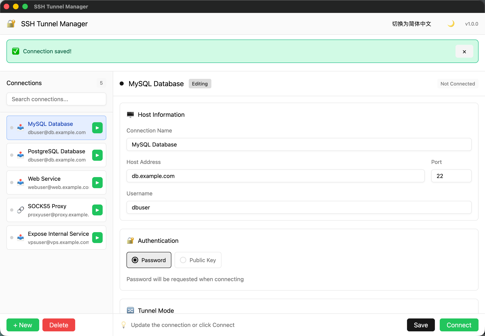

<div align="center">

# SSH Tunnel Manager

**A modern SSH tunnel and port forwarding manager with GUI and CLI interfaces**

Built with Rust 🦀 and GPUI for blazing-fast performance

[](https://github.com/myxiaoao/SSH-Tunnel-Manager/actions/workflows/ci.yml)
[](https://github.com/myxiaoao/SSH-Tunnel-Manager/actions/workflows/release.yml)
[](LICENSE)
[](https://www.rust-lang.org)
[](https://www.apple.com/macos)



---

A modern alternative to command-line SSH tunneling, combining intuitive GUI management with powerful CLI flexibility through a seamless, high-performance interface.

</div>

## Features

- **Multiple Forwarding Types**: Support for Local (-L), Remote (-R), and Dynamic/SOCKS5 (-D) port forwarding
- **Dual Interface**: Both GUI (GPUI-based) and CLI modes
- **Authentication**: Password and public key authentication support
- **Session Management**: Real-time monitoring with traffic statistics and idle timeout
- **Jump Host Support**: Connect through bastion/jump hosts
- **Cross-Platform**: Works on macOS (universal binary for arm64 and x86_64)
- **Internationalization**: English and Simplified Chinese support
- **Persistent Configuration**: TOML-based configuration storage

## Download

Download the latest release from [GitHub Releases](https://github.com/myxiaoao/SSH-Tunnel-Manager/releases):

- **macOS App**: `SSH-Tunnel-Manager-vX.X.X-macos.zip` - GUI application
- **macOS CLI**: `ssh-tunnel-manager-vX.X.X-macos-universal.tar.gz` - Command line tool

## Requirements

- macOS 12.0+
- For building from source: Rust 1.87+, Xcode Command Line Tools

## Installation

### From Release (Recommended)

1. Download the latest release from [Releases](https://github.com/myxiaoao/SSH-Tunnel-Manager/releases)
2. For GUI: Unzip and drag `SSH Tunnel Manager.app` to `/Applications`
3. For CLI: Extract and move to your PATH

### From Source

```bash
# Clone the repository
git clone https://github.com/myxiaoao/SSH-Tunnel-Manager.git
cd SSH-Tunnel-Manager

# Build with GUI support
cargo build --release --features gui

# Or build CLI only
cargo build --release

# Or use the packaging script
./scripts/package-macos.sh --universal
```

## Usage

### GUI Mode

```bash
# Run the app
./target/release/ssh-tunnel-manager --gui

# Or open the packaged app
open "SSH Tunnel Manager.app"
```

### CLI Mode

```bash
# Interactive mode (default)
./target/release/ssh-tunnel-manager

# Or explicitly
./target/release/ssh-tunnel-manager --interactive

# List saved connections
./target/release/ssh-tunnel-manager list

# Show available templates
./target/release/ssh-tunnel-manager templates

# View active sessions
./target/release/ssh-tunnel-manager sessions
```

## Configuration

Configuration files are stored in platform-specific locations:

| Platform | Path |
|----------|------|
| macOS | `~/Library/Application Support/com.myxiaoao.ssh-tunnel-manager/connections.toml` |
| Linux | `~/.config/ssh-tunnel-manager/connections.toml` |
| Windows | `%APPDATA%\ssh-tunnel-manager\connections.toml` |

### Example Configuration

```toml
[[connections]]
id = "11111111-1111-1111-1111-111111111111"
name = "Production MySQL"
host = "bastion.example.com"
port = 22
username = "deploy"
created_at = "2025-12-07T00:00:00Z"
updated_at = "2025-12-07T00:00:00Z"

[connections.auth_method]
type = "publickey"
private_key_path = "~/.ssh/id_rsa"
passphrase_required = false

[[connections.forwarding_configs]]
type = "Local"
local_port = 3306
remote_host = "mysql.internal.example.com"
remote_port = 3306
bind_address = "127.0.0.1"
```

### Forwarding Types

**Local Forwarding (-L)**: Forward a local port to a remote host through SSH

```toml
[[connections.forwarding_configs]]
type = "Local"
local_port = 3306
remote_host = "localhost"
remote_port = 3306
bind_address = "127.0.0.1"
```

**Remote Forwarding (-R)**: Forward a remote port to a local host

```toml
[[connections.forwarding_configs]]
type = "Remote"
remote_port = 8080
local_host = "localhost"
local_port = 3000
```

**Dynamic/SOCKS5 Forwarding (-D)**: Create a SOCKS5 proxy

```toml
[[connections.forwarding_configs]]
type = "Dynamic"
local_port = 1080
bind_address = "127.0.0.1"
socks_version = "socks5"
```

### Jump Host Configuration

```toml
[[connections.jump_hosts]]
host = "bastion.example.com"
port = 22
username = "jump-user"

[connections.jump_hosts.auth_method]
type = "publickey"
private_key_path = "~/.ssh/bastion_key"
passphrase_required = false
```

## Development

### Building

```bash
# Debug build
cargo build

# Release build
cargo build --release

# With GUI feature
cargo build --release --features gui

# Universal binary (macOS)
./scripts/package-macos.sh --universal
```

### Testing

```bash
# Run all tests
cargo test

# Run tests with output
cargo test -- --nocapture

# Run specific test file
cargo test --test validation_integration_test
```

### Code Quality

```bash
# Run clippy
cargo clippy -- -D warnings

# Check formatting
cargo fmt -- --check

# Format code
cargo fmt
```

## Project Structure

```
ssh-tunnel-manager/
├── src/
│   ├── main.rs           # Entry point
│   ├── cli/              # CLI implementation
│   ├── models/           # Data models
│   ├── services/         # Business logic (SSH, tunnel, session)
│   ├── state/            # Application state management
│   ├── ui/               # GUI implementation (GPUI)
│   └── utils/            # Utilities (i18n, logging, validation)
├── tests/                # Integration tests
├── locales/              # Translation files (en, zh-CN)
├── scripts/              # Build and packaging scripts
└── examples/             # Example configurations
```

## Tech Stack

- **Language**: Rust
- **SSH**: russh (pure Rust SSH implementation)
- **GUI**: GPUI (GPU-accelerated UI framework)
- **Async Runtime**: Tokio
- **Configuration**: TOML with Serde
- **i18n**: rust-i18n

## License

This project is licensed under the MIT License - see the [LICENSE](LICENSE) file for details.

## Author

Cooper
